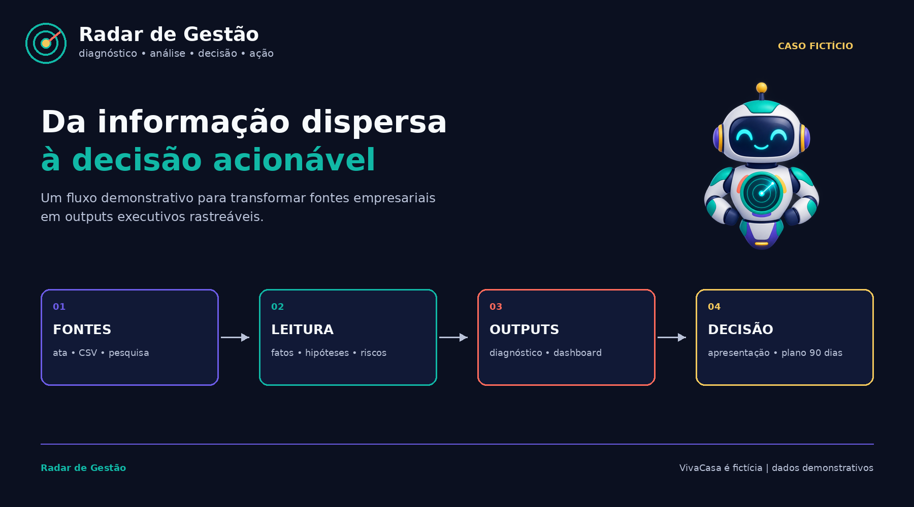
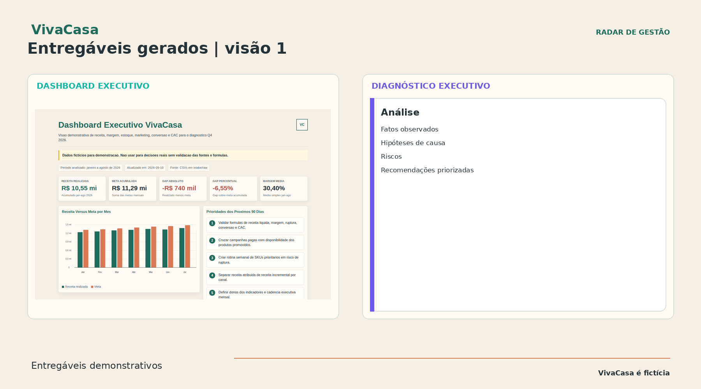
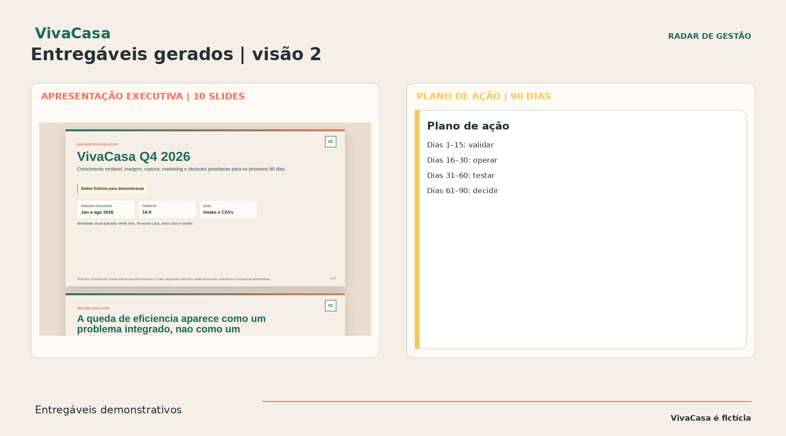
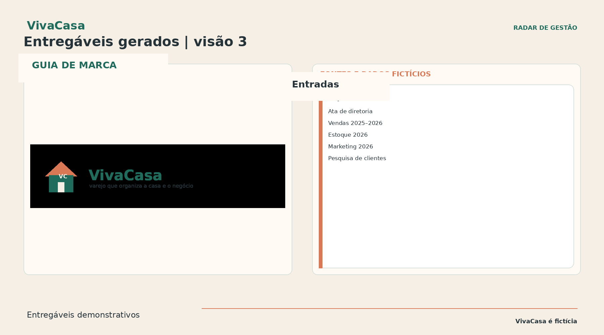

# Radar de Gestão — Demonstração VivaCasa

> **Da informação dispersa à decisão acionável.**

  

## O que este repositório demonstra

Este repositório é uma **demonstração pública de um fluxo analítico**, não a publicação de um sistema interno. Ele mostra como um projeto de consultoria pode transformar atas de reunião, dados estruturados e pesquisa de clientes em entregáveis prontos para apoiar decisões.

O caso é fictício. A empresa, as pessoas, os resultados, as metas e as recomendações foram criados para demonstração.







O fluxo foi desenhado para responder a uma pergunta executiva prática:

> **O que uma liderança de varejo deve fazer quando a receita está abaixo do plano, a margem está pressionada, a ruptura está aumentando e a mídia paga está ficando menos eficiente?**

## A história em um minuto

A VivaCasa é uma varejista omnicanal fictícia, com 12 lojas físicas, operação própria de comércio eletrônico e presença selecionada em marketplaces. De janeiro a agosto de 2026, os dados demonstrativos mostram:

| Sinal | Resultado demonstrativo |
|---|---:|
| Receita líquida | R$ 10,55 mi |
| Meta de receita | R$ 11,29 mi |
| Diferença para a meta | -R$ 740 mil / -6,55% |
| Margem média de contribuição | 30,40% |
| Meta fictícia de margem | 32,00% |
| Tendência de ruptura | Aumentou em todas as categorias |
| Mídia paga | Mais investimento, menor conversão |
| Canais de retenção | CAC informado menor e conversão maior |

A recomendação resultante não é “gastar mais”. É **conectar disponibilidade de estoque, margem de contribuição, decisões de campanha e governança de indicadores antes de escalar a demanda**.

## Explore os entregáveis

### 1. Diagnóstico executivo

Leia o [diagnóstico executivo completo](outputs/analysis/diagnostico-executivo-vivacasa.md) para acompanhar a cadeia de raciocínio: fatos observados, hipóteses, riscos, recomendações, limitações e fontes.

### 2. Dashboard interativo

Abra o [dashboard executivo](outputs/dashboard/dashboard-executivo-vivacasa.html) localmente no navegador. Ele apresenta receita versus meta, margem, ruptura, eficiência de marketing e prioridades dos próximos 90 dias em uma única visão.

### 3. Apresentação executiva

Abra a [apresentação executiva com 10 slides](outputs/presentation/apresentacao-executiva-vivacasa.html). Ela transforma a análise em uma narrativa para a liderança: situação, evidências, diagnóstico, plano de ação e decisões solicitadas.

### 4. Plano de ação de 90 dias

Leia o [plano de ação de 90 dias](docs/plano-acao-90-dias-vivacasa.md) para ver como as recomendações se transformam em responsáveis, prazos, indicadores, dependências e riscos.

## Como as evidências estão organizadas

```text
demo-data/
├── ata-reuniao-diretoria-2026-09-05.md
├── pesquisa-clientes-agosto-2026.md
├── resultados-vendas-2025-2026.csv
├── resultados-estoque-2026.csv
└── resultados-marketing-2026.csv

outputs/
├── analysis/       diagnóstico executivo
├── dashboard/      dashboard HTML local
└── presentation/   apresentação HTML com 10 slides

docs/
├── case-study.md
├── plano-acao-90-dias-vivacasa.md
└── naming-options.md

assets/
├── radar-de-gestao-logo.png
├── radar-gestao-robot.png
├── radar-gestao-resumo-fluxo.png
├── vivacasa-logo.png
└── vivacasa-outputs-01..03.png
```

## Executar localmente

Os entregáveis demonstrativos não exigem backend nem instalação de pacotes.

```bash
python3 -m http.server 8000
```

Depois, abra:

- <http://localhost:8000/outputs/dashboard/dashboard-executivo-vivacasa.html>
- <http://localhost:8000/outputs/presentation/apresentacao-executiva-vivacasa.html>

## O que deliberadamente não está incluído

Este repositório **não** publica o framework interno, regras operacionais privadas, conectores, credenciais ou detalhes de implementação do sistema que produziu a demonstração. Ele publica apenas o **caso, as entradas fictícias, a documentação metodológica e os entregáveis gerados**.

## Reutilizar este padrão com um cliente real

Em um projeto real, substitua as entradas fictícias por materiais aprovados, agregados ou anonimizados. Preserve a mesma disciplina:

1. Registre a fonte e o período de cada indicador.
2. Separe fatos, hipóteses, recomendações e decisões.
3. Deixe as fórmulas explícitas antes de construir o dashboard.
4. Marque as limitações dos dados e as perguntas ainda não resolvidas.
5. Mantenha os entregáveis executivos rastreáveis aos arquivos de origem.
6. Obtenha aprovação do cliente antes de publicar qualquer resultado real.

## Aviso

A VivaCasa é fictícia. Todos os dados, metas, nomes, conclusões e recomendações deste repositório são ilustrativos e não devem ser tratados como informações empresariais reais nem como recomendação de investimento.
